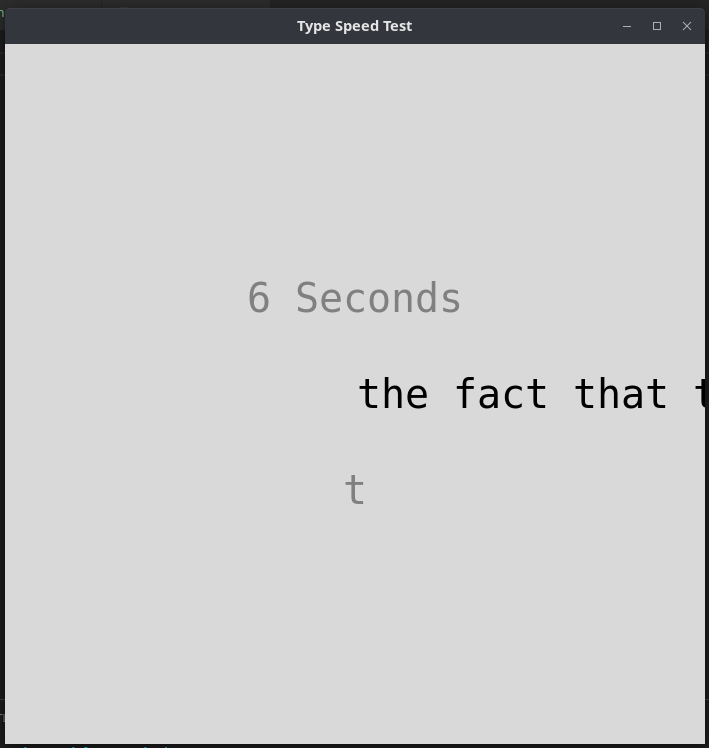
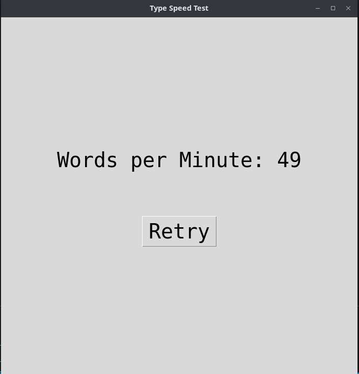

## Typing Test Application proudly made with Python

> A program with which is made with Python, with the interface possible by Tkinter, a default GUI libray in python.

<div align="center">

</div>
It uses a timer, which goes from 0 to 60, after the 60 hits you can see your word per mintue speed.
<div align="center">

</div>

# Running it locally
<h4>Using python3 for linux</h4>

```
$ python3 -m venv venv 
$ python3 source venv/bin/activate
$ python3 pip install -r requirements.txt
$ python3 typing_test.py
```